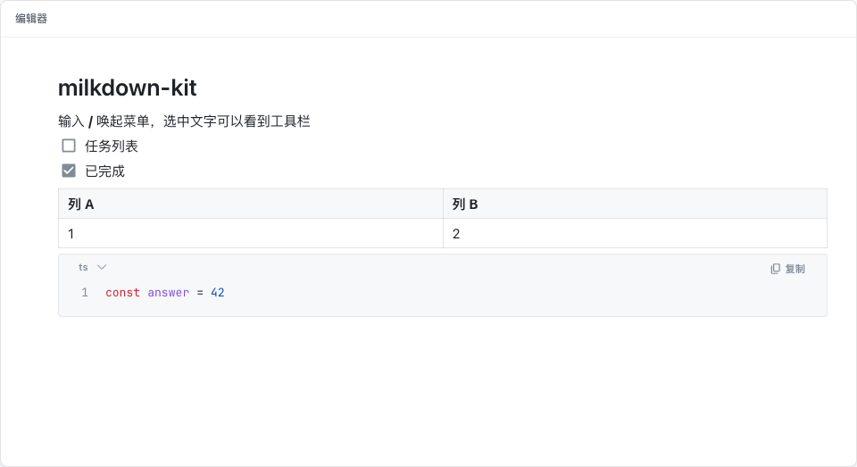

# milkdown-kit

基于 [Milkdown](https://milkdown.dev) Crepe 预配置好的 Markdown 编辑器：中文界面、紧凑主题、暗色模式、Vue 3 / React 19 组件，开箱即用

> 本项目不是 Milkdown 官方项目。官方包名是 `@milkdown/kit`，注意区分



## 包

| 包 | 用途 |
|---|---|
| [`@altmanlib/milkdown-kit-vue`](packages/vue) | Vue 3 组件 |
| [`@altmanlib/milkdown-kit-react`](packages/react) | React 19 组件 |
| [`@altmanlib/milkdown-kit`](packages/core) | 不依赖框架的核心 API 和样式；框架组件都基于它 |

所有包使用同一个版本号

## 安装

```bash
# Vue
npm install @altmanlib/milkdown-kit-vue

# React
npm install @altmanlib/milkdown-kit-react

# Without a framework
npm install @altmanlib/milkdown-kit
```

Vue 组件要求项目中已安装 `vue@^3.5`。React 组件要求 `react@^19` 和 `react-dom@^19`

## 使用

### Vue

```vue
<script setup lang="ts">
import '@altmanlib/milkdown-kit-vue/style.css'
import { MdEditor } from '@altmanlib/milkdown-kit-vue'
import { ref } from 'vue'

const content = ref('# Hello')

async function uploadImage(file: File): Promise<string> {
  // Upload to your storage and return the public URL
  return 'https://example.com/image.png'
}
</script>

<template>
  <MdEditor v-model="content" :upload-image="uploadImage" />
</template>
```

### React

```tsx
import '@altmanlib/milkdown-kit-react/style.css'
import { MdEditor } from '@altmanlib/milkdown-kit-react'
import { useState } from 'react'

export function App() {
  const [content, setContent] = useState('# Hello')

  async function uploadImage(file: File): Promise<string> {
    // Upload to your storage and return the public URL
    return 'https://example.com/image.png'
  }

  return <MdEditor value={content} onChange={setContent} uploadImage={uploadImage} />
}
```

### 不使用框架

```ts
import '@altmanlib/milkdown-kit/style.css'
import { createEditor } from '@altmanlib/milkdown-kit'

const editor = await createEditor(document.querySelector('#editor')!, {
  defaultValue: '# Hello',
  onChange: (markdown) => console.log(markdown),
})

editor.getMarkdown()
editor.setMarkdown('# Replaced')
await editor.destroy()
```

### 按需加载（推荐）

编辑器的 JS 约 240 KB（gzip）。编辑器不在首屏时，用异步组件加载，首屏只多一个很小的入口：

```vue
<script setup lang="ts">
import '@altmanlib/milkdown-kit-vue/style.css'
import { defineAsyncComponent, ref } from 'vue'

const MdEditor = defineAsyncComponent(() =>
  import('@altmanlib/milkdown-kit-vue').then((m) => m.MdEditor),
)

const content = ref('# Hello')
</script>

<template>
  <MdEditor v-model="content" />
</template>
```

```tsx
import '@altmanlib/milkdown-kit-react/style.css'
import { lazy, Suspense, useState } from 'react'

const MdEditor = lazy(() =>
  import('@altmanlib/milkdown-kit-react').then((m) => ({ default: m.MdEditor })),
)

export function App() {
  const [content, setContent] = useState('# Hello')
  return (
    <Suspense fallback={null}>
      <MdEditor value={content} onChange={setContent} />
    </Suspense>
  )
}
```

样式（约 8 KB gzip）保持静态引入，避免编辑器出现时闪烁。代码块各语言的语法本身就是用到时才加载

## 配置

| 选项 | 类型 | 默认 | 说明 |
|---|---|---|---|
| `defaultValue` | `string` | `''` | 初始内容（Vue 用 `v-model`，React 用 `value` / `onChange`） |
| `readonly` | `boolean` | `false` | 只读；Vue 组件中是响应式的 |
| `placeholder` | `string` | 按 `locale` | 空文档的占位文案 |
| `onChange` | `(markdown) => void` | — | 用户编辑后触发，200ms 防抖（Vue 用 `v-model`，React 用 `onChange`） |
| `uploadImage` | `(file) => Promise<string>` | — | 上传图片并返回 URL；不提供时只能粘贴图片链接 |
| `features` | `Partial<Record<FeatureName, boolean>>` | 全部开启 | 关闭某个功能，例如 `{ table: false }` |
| `locale` | `'zh-CN' \| 'en'` | `'zh-CN'` | 界面语言 |
| `codeBlockTools` | `'always' \| 'hover'` | `'always'` | 代码块的语言选择和复制按钮是否一直显示 |

`FeatureName`：`code-mirror`、`list-item`、`link-tooltip`、`cursor`、`image-block`、`block-edit`、`toolbar`、`placeholder`、`table`

除 `readonly` 外，其他选项只在创建时生效。需要变更时，通过 `key` 重建组件

## 主题

在 `.md-editor` 或它的任意祖先元素上覆盖 CSS 变量：

```css
.my-page .md-editor {
  --md-editor-color-primary: #7c3aed;
  --md-editor-font-size: 16px;
  --md-editor-padding: 24px 48px 24px 72px;
}
```

- 暗色模式：在任意祖先元素（例如 `<html>`）上设置 `data-theme="dark"`
- 编辑器本身不带外框和最小高度，由你的页面决定
- 给编辑器外层加样式时不要使用 `overflow: hidden`，否则斜杠菜单和工具栏会被裁掉

## 注意

- 只能在浏览器中运行。SSR 环境中可以 import，但要在客户端挂载（例如 Nuxt 的 `<ClientOnly>`）
- 导出的 Markdown 会做少量格式规范化（例如列表符号统一为 `*`），内容不变

## 开发

项目文档见 [docs/](docs/README.md)

## License

MIT
